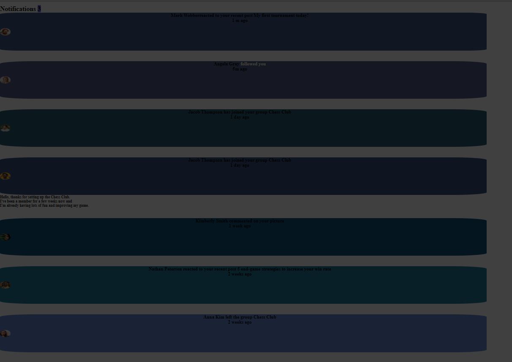

# Quiz 2 - Notifications page solution

This is a solution to the [Notiification homepage Quiz 2 challenge]

## Table of contents

## Overview
    I made a notification page with just HTML and CSS and could not add Jquery/Javascript due to limited time frame for the project. 

### The challenge
    # Notification Page
### Screenshot

### Links

- Solution URL: [Add solution URL here](https://your-solution-url.com)
- Live Site URL: [Add live site URL here](https://your-live-site-url.com)

## My process
I started with creating HTML and then the css. Since we had the html, I just edited and assigned classes to the names. I then used the class tags in the css and add the styling in the css.

### Built with

- HTML
- .Flexbox
- .Box
- Background attributes
- CSS display properties
- Flexbox
- CSS float

### What I learned

I learned different ways to position images in a box and also learned further about padding.

To see how you can add code snippets, see below:
`{
    margin: 0;
    padding: 0;
    box-sizing: border-box;
    text-decoration: none;
    list-style: none;

}`
`
.not {
    padding-top: 10px;
    display: flex;
    justify-content: space-between;

}
`
.

### Continued development

The areas I want to focus on are wrapping everything in a box which I struggled, although I thought this was easier, it did not work for me. 
So, I will focus how to do that in  css next time.

### Useful resources

  ** Geekgs for Geeks https://www.geeksforgeeks.org/css/
  ** W 3 schools https://www.w3schools.com/css/css_align.asp#:~:text=To%20just%20center%20the%20text,This%20text%20is%20centered.

## Your Detail 

- FullName - [Abas Hassan Iman]
- StudentID - [2602192853]
- BINUS Email - [abas.iman@binus.ac.id]

## Acknowledgments

Michele, Brayan and I worked together on this. Thanks to Mr. Bagus for the opportunity.

